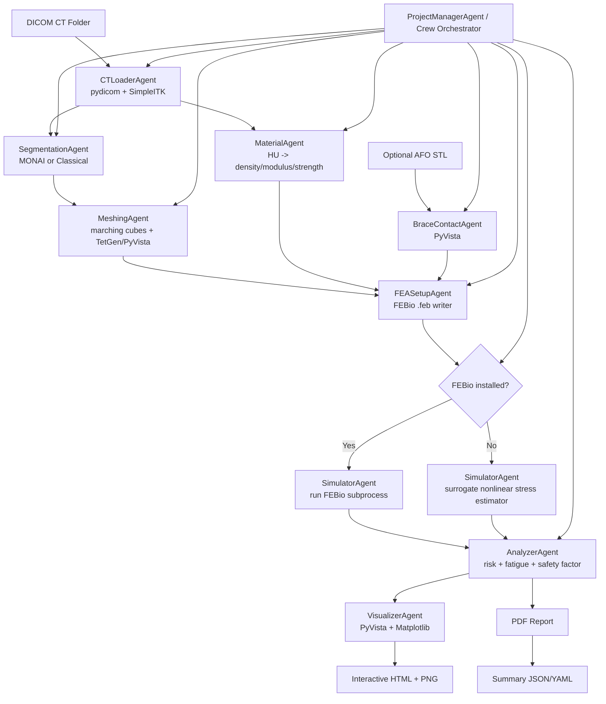

# === CPT FRACTURE PREDICTION SYSTEM - FULL PROJECT OUTLINE ===

`OsteoVigil` is an open-source Python application for lower-leg CT loading, tibial segmentation, tetrahedral mesh generation, density-to-material mapping, FEBio model export, surrogate-or-FEBio simulation, fracture-risk analysis, and clinician-friendly reporting for congenital pseudarthrosis of the tibia (CPT) in a brace-assisted patient workflow.

The app now supports both dedicated tibia/fibula scans and larger bilateral or full-body CT studies. When both legs are present, the preprocessing stage can detect that, let the user choose a target leg, and crop the study down to the tib/fib region before the usual analysis pipeline continues.

## Usage Notice

- This repository is intended as an educational, research, and proof-of-concept project.
- The project is not being offered for resale or commercialization by the author.
- Third parties are not authorized by project intent to repackage, resell, or otherwise use this work for commercial purposes.
- This notice documents the project's intended use. If you want a legally binding non-commercial restriction, the repository license should be updated accordingly.

## Architecture Diagram



## Folder Structure

```text
OsteoVigil/
├── README.md
├── Dockerfile
├── requirements.txt
├── main.py
├── streamlit_app.py
├── config/
│   └── default.yaml
├── data/
│   └── sample/
├── outputs/
├── scripts/
└── src/
    └── cpt_predictor/
        ├── __init__.py
        ├── analysis.py
        ├── brace.py
        ├── cli.py
        ├── config.py
        ├── fea.py
        ├── logging_utils.py
        ├── materials.py
        ├── meshing.py
        ├── models.py
        ├── pipeline.py
        ├── preprocessing.py
        ├── reporting.py
        ├── segmentation.py
        ├── simulator.py
        ├── visualization.py
        ├── agents/
        │   ├── __init__.py
        │   └── crew.py
        ├── io/
        │   ├── __init__.py
        │   ├── dicom_loader.py
        │   └── sample_data.py
        └── utils/
            └── __init__.py
```

## Tech Stack

All tooling is free/open-source.

| Area | Library | Pinned Version |
| --- | --- | --- |
| Python runtime | Python | 3.11+ recommended |
| DICOM / image IO | `pydicom` | `2.4.4` |
| Medical image toolkit | `SimpleITK` | `2.3.1` |
| Classical imaging | `scikit-image` | `0.22.0` |
| Numerical ops | `numpy` | `1.26.4` |
| Scientific ops | `scipy` | `1.11.4` |
| Deep-learning fallback | `torch` | `2.2.2` |
| Medical DL | `MONAI` | `1.3.2` |
| Mesh IO | `meshio` | `5.3.5` |
| Surface/volume mesh ops | `pyvista` | `0.43.10` |
| VTK backend | `vtk` | `9.3.0` |
| Tet meshing | `tetgen` | `0.6.4` |
| CAD/meshing alternative | `gmsh`, `pygmsh` | `4.13.1`, `7.1.17` |
| Reporting | `reportlab` | `4.2.2` |
| Plotting | `matplotlib` | `3.8.4` |
| GUI | `streamlit` | `1.35.0` |
| Multi-agent orchestration | `crewai` | `0.41.1` |
| Config | `PyYAML` | `6.0.1` |
| Testing | `pytest` | `8.2.2` |

## Data Flow

1. Load DICOM slices with SimpleITK or pydicom and convert intensities to Hounsfield Units.
2. Resample to near-isotropic spacing, clip HU range, and normalize for optional MONAI inference.
3. Segment the tibia with either:
   - a configured MONAI/TorchScript binary model, or
   - a classical threshold + morphology + connected-component fallback.
4. Reconstruct a surface mesh with marching cubes and tetrahedralize it with TetGen when available, or PyVista as a fallback.
5. Sample HU values at cell centers and convert them to density, Young's modulus, and yield strength using Bonemat-style heuristic equations.
6. Load an AFO STL or create a simplified brace envelope from the tibial bounding box.
7. Export a FEBio `.feb` model with bone domains, quantized material bins, fixed distal boundary conditions, proximal gait loads, and a simplified brace-support proxy.
8. Run FEBio if installed; otherwise run the bundled surrogate structural solver so the workflow remains runnable without proprietary or missing binaries.
9. Compute von Mises stress, strain, safety factor, fatigue-cycle estimate, hotspot regions, and a years-to-failure estimate from daily step counts.
10. Save a PyVista mesh with scalar fields, PNG/HTML visualizations, a PDF report, and summary JSON.

## Assumptions And Limitations

- This repository is designed as a transparent research/engineering starter kit, not a validated medical device.
- The default segmentation is classical and robust enough for many CT studies, but not equivalent to a clinically validated nnU-Net or MONAI bundle.
- The bundled FEBio writer uses quantized material bins plus a brace-support proxy to keep the model reproducible and open-source; advanced shell contact tuning still benefits from expert FEBio calibration.
- If FEBio is unavailable, the code falls back to a documented surrogate stress model. That keeps the application runnable, but it is not a substitute for a full nonlinear contact solve.
- Fatigue-life estimation uses a simple phenomenological damage law and should be treated as scenario analysis, not a forecast guarantee.
- Lower-leg muscle, ligament, and joint reaction forces are simplified into gait-phase load multipliers unless the user customizes them.

## Ethical / Medical Disclaimers

- For research and educational use only.
- Proof-of-concept software only; not a commercial medical product.
- The author does not authorize resale, repackaging, or commercial exploitation of this project.
- Not for diagnosis, treatment planning, or unsupervised clinical decision-making.
- Predictions depend heavily on CT quality, brace geometry, load assumptions, and segmentation quality.
- Any use on real patients should include review by an orthopaedic surgeon, radiologist, and biomechanical engineer.
- CPT cases are highly heterogeneous; pathology-specific validation is required before any clinical deployment.

## Estimated Compute Needs

| Scenario | CPU | RAM | GPU | Typical Runtime |
| --- | --- | --- | --- | --- |
| Dummy/demo run | 4 cores | 4-8 GB | Not required | 1-3 min |
| Real CT, classical segmentation | 6-8 cores | 8-16 GB | Not required | 5-15 min |
| Real CT, MONAI inference | 8+ cores | 16+ GB | 8+ GB VRAM recommended | 3-10 min |
| Large mesh + FEBio solve | 8-16 cores | 16-32 GB | Optional | 10-45+ min |

## Multi-Agent Design Summary

The repository includes a local deterministic orchestrator plus CrewAI-compatible agent manifests for:

- `ProjectManagerAgent`
- `CTLoaderAgent`
- `SegmentationAgent`
- `MeshingAgent`
- `MaterialAgent`
- `BraceContactAgent`
- `FEASetupAgent`
- `SimulatorAgent`
- `AnalyzerAgent`
- `VisualizerAgent`

Each agent has a role, goal, backstory, handoff contract, and pipeline stage function. The system can run fully offline or optionally instantiate CrewAI `Agent` objects when an LLM is available for narration, approvals, or planning.

## Installation

1. Install Python 3.11 or 3.12.
2. Create a virtual environment.
3. Install PyTorch for your CPU/CUDA platform from [pytorch.org](https://pytorch.org/get-started/locally/).
4. Install project dependencies:

```bash
pip install -r requirements.txt
```

5. Optional: run the local FEBio installer if you want to provision FEBio before launching the app:

```bash
python install_febio.py
```

This installer attempts a repo-local FEBio install under `.third_party/febio/` by first checking the latest official `febiosoftware/FEBio` GitHub release assets and then falling back to an automatic source build. If the managed FEBio install is unavailable, the app still runs with its documented surrogate solver.

## How To Run

CLI:

```bash
python main.py --dummy-data --output-dir outputs/demo_run
```

Real CT:

```bash
python main.py --dicom-dir /path/to/dicom_folder --brace-stl /path/to/afo.stl --output-dir outputs/patient_run
```

Streamlit UI:

```bash
streamlit run streamlit_app.py
```

Single-command bootstrap from the repo root:

```bash
python bootstrap.py
```

If your default `python` is Python 3.11 or newer, this command now creates `.venv` if needed, installs `requirements.txt`, attempts a managed FEBio install into `.third_party/febio/`, and launches the default UI for your platform. On macOS, the default UI is Streamlit for reliability. You can also target other entrypoints:

```bash
python bootstrap.py --entrypoint cli -- --dummy-data --output-dir outputs/demo_run
python bootstrap.py --entrypoint streamlit
```

If your machine has multiple Python versions installed, use a 3.11+ interpreter explicitly:

```bash
python3.11 bootstrap.py
```

To force a fresh FEBio install attempt during bootstrap:

```bash
python bootstrap.py --force-febio-reinstall
```

Desktop launcher:

- macOS: double-click [launch_osteovigil.command](/Users/anthonyditano/Documents/GitHub/OsteoVigil/launch_osteovigil.command)
- Windows: double-click [launch_osteovigil.bat](/Users/anthonyditano/Documents/GitHub/OsteoVigil/launch_osteovigil.bat)

On first launch, the launcher now delegates to [bootstrap.py](/Users/anthonyditano/Documents/GitHub/OsteoVigil/bootstrap.py), which:

1. creates `.venv` if missing
2. installs `requirements.txt` into that environment
3. attempts an automatic FEBio install into `.third_party/febio/`
4. starts the platform-default UI

macOS note:

- the `.command` launcher now opens the Streamlit interface by default to avoid a PyQt/Qt startup issue affecting some macOS environments
- the bundled Streamlit config disables file watching and usage-stat collection to reduce noisy macOS permission prompts during startup
- the PyQt desktop app remains available for manual testing with `python bootstrap.py --entrypoint desktop`

## Outputs

- `summary.json`
- `simulation_manifest.json`
- `tibia_mesh.vtu`
- `material_mesh.vtu`
- `stress_heatmap_2d.png`
- `stress_map.png`
- `risk_dashboard.png`
- `interactive_mesh.html` when supported
- `cpt_fracture_report.pdf`
- `model.feb`

## Demo Cases

Two demo cases are included under [data/demo/README.md](/Users/anthonyditano/Documents/GitHub/OsteoVigil/data/demo/README.md):

- `normal_real_talocrural`: a real public distal tibia/fibula/ankle DICOM series
- `abnormal_synthetic_cpt`: a synthetic CPT-style abnormal DICOM series with a proxy brace STL

In the Streamlit UI, these now appear as an explicit bundled-demo selector so you can choose the normal/good or abnormal/bad tibia demo without relying on the older synthetic fallback wording. The results view also includes a direct PDF export button and focuses on charts rather than raw JSON output.

## Next Steps / Improvements

1. Replace the classical segmentation fallback with a CPT-tuned nnU-Net or MONAI bundle.
2. Upgrade load application using OpenSim or EMG-informed musculoskeletal outputs.
3. Add subject-specific brace shell meshing and explicit FEBio contact pairs.
4. Add calibration against cadaveric or phantom data for HU-to-property mapping.
5. Introduce asynchronous job queues and cloud deployment.
6. Add DICOM RTStruct and PACS export hooks.
