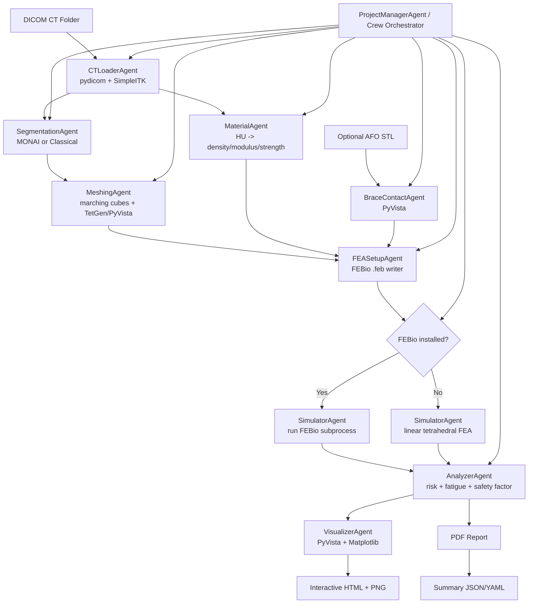

# OsteoVigil

OsteoVigil estimates how a tibia and fibula carry a vertical load, compared with a normal leg.

Drop a DICOM series, or a zip of one, on the local website. The site classifies the study as CT, MRI, or a radiograph and reports:

- percent weaker or stronger than a normal tib/fib of the same length
- failure load in newtons and in multiples of body weight
- whether that estimate covers level walking and ordinary daily loads
- AP and lateral maps of where the limb is more highly utilized than the normal leg

This is a research biomechanical estimate. It is not a diagnosis, not a medical device, and not a clearance to walk.

The congenital-pseudarthrosis CLI, Streamlit app, desktop app, and FEBio export are still in the repo. The website does not use that path. A missing FEBio install is not a successful strength analysis.

## Run the strength site

From the repo root, with Python 3.11+ and Node.js available:

```bash
python bootstrap.py
```

Then open http://127.0.0.1:8765 . Bootstrap creates `.venv`, installs `requirements.txt`, builds `web/`, and starts the site. It skips the FEBio install for this entrypoint.

GitHub Actions deploys the same page to https://aditano.github.io/OsteoVigil/ from `main` (`.github/workflows/pages.yml`). In the repository settings, set Pages to deploy from GitHub Actions: https://github.com/aditano/OsteoVigil/settings/pages . That build runs this Python solver in the browser with Pyodide. The DICOM stays on the computer that opened the page.

## What CPU and GPU mean here

While an analysis runs, the page shows a progress bar and a compute badge.

**Compute** is the strength solve. On GitHub Pages that is Pyodide: CPython compiled to WebAssembly, on the main thread, so the badge says `Compute: CPU (Pyodide/WASM, main thread)`. The finite-element solve and the radiograph cortical-index solve both stay on the CPU. JPEG 2000 and lossless JPEG are decoded on the CPU as well (OpenJPEG and a lossless JPEG decoder in the browser) and passed into that solver. Nothing in this path uploads the DICOM.

**Display** is how the AP and lateral views are drawn. Those canvases use the ordinary 2D canvas API, so the badge says `Display: CPU (2D canvas)`. It says `Display: GPU (WebGL)` only when the views are actually drawn with a WebGL context. A CT or MRI weakness projection may use a WebGPU compute shader when the browser has one and the shader matches the CPU projection. That shader does not move the solve onto the GPU.

If the browser cannot create a WebGL context and has no WebGPU adapter, the badge says `GPU unavailable · CPU only`.

The percent is how far this run has gotten: Pyodide, NumPy, SciPy, DICOM codecs, reading the files, decoding each image, solving, then drawing the views. Finished steps move the bar forward. A long solve holds the main thread, so the bar stays on that stage until the solver returns instead of inventing a percent inside it.

Body mass comes from the DICOM `PatientWeight` tag when that tag is present and the checkbox is on. Otherwise edit the mass field. The field starts at 70 kg and stays visible.

To build and serve it yourself:

```bash
cd web && npm install && npm run build && cd ..
PYTHONPATH=src python -m uvicorn cpt_predictor.api:app --app-dir src --host 127.0.0.1 --port 8765
```

## How the estimate is made

### CT

CT is the quantitative path. Each bone voxel is an 8-node brick in a linear-elastic solve. Distal nodes are fixed. A proximal axial force equal to body weight is applied. Because the model is linear, failure load is that force times the multiplier at which 2% of interior cortical voxels exceed yield. Tibia and fibula stay in one model when the segmenter can separate them.

Material law:

- Trabecular bone follows Morgan et al. 2003: `E = 6850 * rho_app^1.49` MPa, with `rho_ash = max(0.05, 0.000887 * HU + 0.0633)` and `rho_app = clip(1.04 * rho_ash, 0.10, 2.40)`.
- A cortical branch blends in so roughly 1200–1800 HU lands near 12–18 GPa.
- Yield strength remains `clip(114.8 * rho_app^1.72, 2, 220)` MPa.

A random clinical CT has no density phantom. Absolute newtons carry that uncertainty, and the page says so. The percent comparison uses the same law on both legs.

### Normal leg

The reference is a deterministic tibia and fibula generated from published adult midshaft proportions: tibial periosteal radius about 13 mm with about 5 mm of cortex, and a narrower fibula offset laterally. Length matches the scanned bone. Percent weaker is `100 * (1 - F_patient / F_reference)`. A stronger limb is reported as percent stronger.

### Walking

Thresholds follow in vivo knee contact forces from Bergmann et al. 2014 (OrthoLoad):

- below 2.8× body weight: not expected to tolerate level walking unassisted
- from 2.8× up to 4.0× body weight: level walking may be tolerated; stairs and unassisted daily life exceed the estimated margin
- at or above 4.0× body weight: estimated to tolerate unassisted walking and ordinary daily loads

### MRI

Clinical MRI does not measure bone density. The dark cortical ring is segmented and solved with a uniform cortical modulus of 17 GPa and a yield of 120 MPa. The percent is geometric stiffness versus the normal leg. If the ring cannot be segmented, the page returns that failure and does not invent a percent.

### Radiograph

Cortical index is measured along the shaft from the bone edges. One view assumes a circular cross-section, and the page says so. Two views are combined as an ellipse. The comparison is against a digitally reconstructed radiograph of the reference leg. The weakness map is painted on the acquired view.

### Maps

Weakness is utilization (stress / yield) of the scanned leg minus the normal leg at the same relative height. The AP projection collapses the anteroposterior axis. The lateral projection collapses the mediolateral axis. The browser uploads the volume and a WebGPU compute shader builds those projections when WebGPU is available. The same projection written in TypeScript is the fallback and the check against the GPU result.

## Sample data

- `data/demo/normal_real_talocrural`: CC0 distal tibia/fibula/ankle CT, Zenodo [10.5281/zenodo.4274217](https://doi.org/10.5281/zenodo.4274217), 325 slices. On 2026-09-23 the voxel solve finished with a finite failure load of about 1.5 kN (2.2× body weight at 70 kg) and stated that the field is distal, not a full tibial shaft. The ankle bones stay one connected component, so the fibula is not split out.
- `data/demo/abnormal_synthetic_cpt`: synthetic series with a low-density shaft band. It fails at a lower load than a repaired copy of the same volume, and the weakness hotspot sits on that band.
- `scripts/download_full_limb_ct.py` reads the Virtual Skeleton Database mirror, Zenodo [10.5281/zenodo.8270365](https://doi.org/10.5281/zenodo.8270365) (CC BY-NC-SA). The CT archives are about 0.7–2 GB each, above the 400 MB cap, so the script skips them and does not commit a download.

## Tests

```bash
PYTHONPATH=src python -m pytest tests/test_strength_core.py tests/test_strength_evidence.py tests/test_strength_browser.py
```

The browser check uses Playwright against installed Google Chrome. The page must show CT, a numeric percent, both view canvases, and the research banner. It must not say surrogate or demo mode.

## Legacy CPT workflow

The sections below describe the older brace-assisted CPT pipeline. Launch it with `python bootstrap.py --entrypoint cli`, `--entrypoint streamlit`, or `--entrypoint desktop`. Those entrypoints still attempt a managed FEBio install. If FEBio is missing, that legacy path solves a linear tetrahedral model of the same mesh. The strength website never treats that as its result.

## Usage Notice

- This repository is intended as an educational, research, and proof-of-concept project.
- The project is not being offered for resale or commercialization by the author.
- Third parties are not authorized by project intent to repackage, resell, or otherwise use this work for commercial purposes.
- This notice documents the project's intended use. If you want a legally binding non-commercial restriction, the repository license should be updated accordingly.

## Architecture Diagram


```mermaid
flowchart TD
    A["DICOM CT Folder"] --> B["CTLoaderAgent<br/>pydicom + SimpleITK"]
    X["Optional AFO STL"] --> F["BraceContactAgent<br/>PyVista"]
    B --> C["SegmentationAgent<br/>MONAI or Classical"]
    C --> D["MeshingAgent<br/>marching cubes + TetGen/PyVista"]
    B --> E["MaterialAgent<br/>HU -> density/modulus/strength"]
    D --> G["FEASetupAgent<br/>FEBio .feb writer"]
    E --> G
    F --> G
    G --> H{"FEBio installed?"}
    H -->|Yes| I["SimulatorAgent<br/>run FEBio subprocess"]
    H -->|No| J["SimulatorAgent<br/>linear tetrahedral FEA"]
    I --> K["AnalyzerAgent<br/>risk + fatigue + safety factor"]
    J --> K
    K --> L["VisualizerAgent<br/>PyVista + Matplotlib"]
    K --> M["PDF Report"]
    L --> N["Interactive HTML + PNG"]
    M --> O["Summary JSON/YAML"]
    P["ProjectManagerAgent / Crew Orchestrator"] --> B
    P --> C
    P --> D
    P --> E
    P --> F
    P --> G
    P --> H
    P --> K
```

## Folder Structure

```text
OsteoVigil/
├── README.md
├── Dockerfile
├── requirements.txt
├── main.py
├── streamlit_app.py
├── config/
│   └── default.yaml
├── data/
│   └── sample/
├── outputs/
├── scripts/
└── src/
    └── cpt_predictor/
        ├── __init__.py
        ├── analysis.py
        ├── brace.py
        ├── cli.py
        ├── config.py
        ├── fea.py
        ├── logging_utils.py
        ├── materials.py
        ├── meshing.py
        ├── models.py
        ├── pipeline.py
        ├── preprocessing.py
        ├── reporting.py
        ├── segmentation.py
        ├── simulator.py
        ├── visualization.py
        ├── agents/
        │   ├── __init__.py
        │   └── crew.py
        ├── io/
        │   ├── __init__.py
        │   ├── dicom_loader.py
        │   └── sample_data.py
        └── utils/
            └── __init__.py
```

## Tech Stack

All tooling is free/open-source.

| Area | Library | Pinned Version |
| --- | --- | --- |
| Python runtime | Python | 3.11+ recommended |
| DICOM / image IO | `pydicom` | `2.4.4` |
| Medical image toolkit | `SimpleITK` | `2.3.1` |
| Classical imaging | `scikit-image` | `0.22.0` |
| Numerical ops | `numpy` | `1.26.4` |
| Scientific ops | `scipy` | `1.11.4` |
| Deep-learning fallback | `torch` | `2.2.2` |
| Medical DL | `MONAI` | `1.3.2` |
| Mesh IO | `meshio` | `5.3.5` |
| Surface/volume mesh ops | `pyvista` | `0.43.10` |
| VTK backend | `vtk` | `9.3.0` |
| Tet meshing | `tetgen` | `0.6.4` |
| CAD/meshing alternative | `gmsh`, `pygmsh` | `4.13.1`, `7.1.17` |
| Reporting | `reportlab` | `4.2.2` |
| Plotting | `matplotlib` | `3.8.4` |
| GUI | local website (`fastapi`, `uvicorn`) and legacy `streamlit` | `0.115.6`, `0.34.0`, `1.35.0` |
| Multi-agent orchestration | `crewai` | `0.41.1` |
| Config | `PyYAML` | `6.0.1` |
| Testing | `pytest` | `8.2.2` |

## Data Flow

1. Load DICOM slices with SimpleITK or pydicom and convert intensities to Hounsfield Units.
2. Resample to near-isotropic spacing, clip HU range, and normalize for optional MONAI inference.
3. Segment the tibia with either:
   - a configured MONAI/TorchScript binary model, or
   - a classical threshold + morphology + connected-component fallback.
4. Reconstruct a surface mesh with marching cubes and tetrahedralize it with TetGen when available, or PyVista as a fallback.
5. Sample HU values at cell centers and convert them to density, Young's modulus, and yield strength using Bonemat-style heuristic equations.
6. Load an AFO STL or create a simplified brace envelope from the tibial bounding box.
7. Export a FEBio `.feb` model with bone domains, quantized material bins, fixed distal boundary conditions, proximal gait loads, and a simplified brace-support proxy.
8. Run FEBio if installed; otherwise solve a linear-elastic tetrahedral finite-element model of the bone mesh. There is no beam-theory surrogate path.
9. Compute von Mises stress, strain, safety factor, fatigue-cycle estimate, hotspot regions, and a years-to-failure estimate from daily step counts.
10. Save a PyVista mesh with scalar fields, PNG/HTML visualizations, a PDF report, and summary JSON.

## Assumptions And Limitations

- This repository is designed as a transparent research/engineering starter kit, not a validated medical device.
- The default segmentation is classical and robust enough for many CT studies, but not equivalent to a clinically validated nnU-Net or MONAI bundle.
- The bundled FEBio writer uses quantized material bins plus a brace-support proxy to keep the model reproducible and open-source; advanced shell contact tuning still benefits from expert FEBio calibration.
- If FEBio is unavailable, the code runs a linear tetrahedral FEA solver on the same mesh, materials, and gait loads. That is still a continuum finite-element analysis, not a beam-theory surrogate, and it is not a substitute for a full nonlinear FEBio contact solve.
- Fatigue-life estimation uses a simple phenomenological damage law and should be treated as scenario analysis, not a forecast guarantee.
- Lower-leg muscle, ligament, and joint reaction forces are simplified into gait-phase load multipliers unless the user customizes them.

## Ethical / Medical Disclaimers

- For research and educational use only.
- Proof-of-concept software only; not a commercial medical product.
- The author does not authorize resale, repackaging, or commercial exploitation of this project.
- Not for diagnosis, treatment planning, or unsupervised clinical decision-making.
- Predictions depend heavily on CT quality, brace geometry, load assumptions, and segmentation quality.
- Any use on real patients should include review by an orthopaedic surgeon, radiologist, and biomechanical engineer.
- CPT cases are highly heterogeneous; pathology-specific validation is required before any clinical deployment.

## Estimated Compute Needs

| Scenario | CPU | RAM | GPU | Typical Runtime |
| --- | --- | --- | --- | --- |
| Dummy/demo run | 4 cores | 4-8 GB | Not required | 1-3 min |
| Real CT, classical segmentation | 6-8 cores | 8-16 GB | Not required | 5-15 min |
| Real CT, MONAI inference | 8+ cores | 16+ GB | 8+ GB VRAM recommended | 3-10 min |
| Large mesh + FEBio solve | 8-16 cores | 16-32 GB | Optional | 10-45+ min |

## Multi-Agent Design Summary

The repository includes a local deterministic orchestrator plus CrewAI-compatible agent manifests for:

- `ProjectManagerAgent`
- `CTLoaderAgent`
- `SegmentationAgent`
- `MeshingAgent`
- `MaterialAgent`
- `BraceContactAgent`
- `FEASetupAgent`
- `SimulatorAgent`
- `AnalyzerAgent`
- `VisualizerAgent`

Each agent has a role, goal, backstory, handoff contract, and pipeline stage function. The system can run fully offline or optionally instantiate CrewAI `Agent` objects when an LLM is available for narration, approvals, or planning.

## Installation

1. Install Python 3.11 or 3.12.
2. Create a virtual environment.
3. Install PyTorch for your CPU/CUDA platform from [pytorch.org](https://pytorch.org/get-started/locally/).
4. Install project dependencies:

```bash
pip install -r requirements.txt
```

5. Optional: run the local FEBio installer if you want to provision FEBio before launching the app:

```bash
python install_febio.py
```

This installer attempts a repo-local FEBio install under `.third_party/febio/` by first checking the latest official `febiosoftware/FEBio` GitHub release assets and then falling back to an automatic source build. If the managed FEBio install is unavailable, the app still runs a built-in linear tetrahedral FEA solver.

## How To Run

The default `python bootstrap.py` command opens the strength site described above.

Legacy CLI:

```bash
python bootstrap.py --entrypoint cli -- --dummy-data --output-dir outputs/demo_run
```

Legacy Streamlit UI:

```bash
python bootstrap.py --entrypoint streamlit
```

Direct CLI, after dependencies are installed:

```bash
python main.py --dummy-data --output-dir outputs/demo_run
python main.py --dicom-dir /path/to/dicom_folder --brace-stl /path/to/afo.stl --output-dir outputs/patient_run
```

If your machine has multiple Python versions installed, use a 3.11+ interpreter explicitly:

```bash
python3.11 bootstrap.py
```

To force a fresh FEBio install during a legacy launch:

```bash
python bootstrap.py --entrypoint cli --force-febio-reinstall
```

Desktop launcher:

- macOS: double-click [launch_osteovigil.command](/Users/anthonyditano/Documents/GitHub/OsteoVigil/launch_osteovigil.command)
- Windows: double-click [launch_osteovigil.bat](/Users/anthonyditano/Documents/GitHub/OsteoVigil/launch_osteovigil.bat)

On first launch, the launcher delegates to `bootstrap.py`, which:

1. creates `.venv` if missing
2. installs `requirements.txt` into that environment
3. builds the website and opens it at http://127.0.0.1:8765
4. skips FEBio unless you select the legacy `cli`, `streamlit`, or `desktop` entrypoint

The PyQt desktop app remains available with `python bootstrap.py --entrypoint desktop`. The Streamlit config still disables file watching and usage-stat collection.

## Outputs

- `summary.json`
- `simulation_manifest.json`
- `tibia_mesh.vtu`
- `material_mesh.vtu`
- `stress_heatmap_2d.png`
- `stress_map.png`
- `risk_dashboard.png`
- `interactive_mesh.html` when supported
- `cpt_fracture_report.pdf`
- `model.feb`

## Demo Cases

Two demo cases are included under [data/demo/README.md](data/demo/README.md):

- `normal_real_talocrural`: a real public distal tibia/fibula/ankle DICOM series
- `abnormal_synthetic_cpt`: a synthetic CPT-style abnormal DICOM series with a proxy brace STL

Public **abnormal** tib/fib CTs are not bundled (no open CPT volume exists). `scripts/download_public_abnormal_cts.py` fetches TCIA calf/lower-limb sarcoma CTs into the gitignored `data/external/` folder. See [data/demo/README.md](data/demo/README.md#public-abnormal-tibfib-cts-not-bundled).

In the Streamlit UI, these now appear as an explicit bundled-demo selector so you can choose the normal/good or abnormal/bad tibia demo without relying on the older synthetic fallback wording. The results view also includes a direct PDF export button and focuses on charts rather than raw JSON output.

## Next Steps / Improvements

1. Replace the classical segmentation fallback with a CPT-tuned nnU-Net or MONAI bundle.
2. Upgrade load application using OpenSim or EMG-informed musculoskeletal outputs.
3. Add subject-specific brace shell meshing and explicit FEBio contact pairs.
4. Add calibration against cadaveric or phantom data for HU-to-property mapping.
5. Introduce asynchronous job queues and cloud deployment.
6. Add DICOM RTStruct and PACS export hooks.
